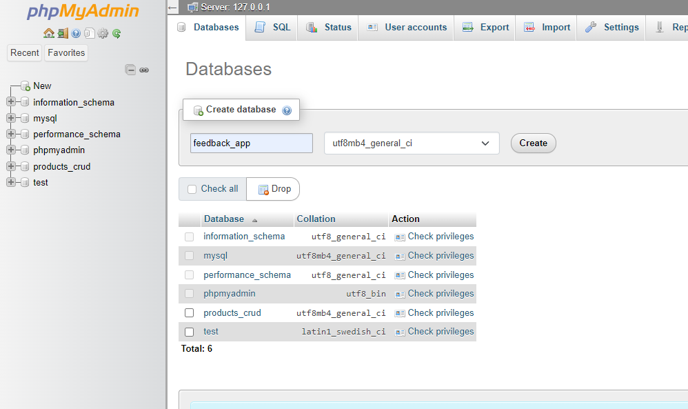

# Universidad De Dagupan Library Feedback App

An application for storing feedback for the library of Universidad De Dagupan.

## Applications required

- XAMPP
- A web browser (ex. Firefox, Chrome, Edge)

## Installation

Before starting, make sure you clone or download the repository to your local machine. Example below shows the repository files within the xampp/htdocs directory (recommended for virtual host configuration).


### Database

Create a database using XAMPP with phpmyadmin, the database name should be named 'feedback_app'. After creating the database, import the 'feedback_app.sql' file that is inside the repository.

Creating a database


Importing a database


Database records examples

feedback table


admin_accounts table


## Running the application

### Running application with built-in PHP server

Open the XAMPP control panel as administrator and start the Apache and MySQL servers, these are needed so that we could run our application.

Open the terminal and change directory into the udd-library-feedback-app/public directory. After that enter the command below to start the application.

`php -S localhost:8080`

You can use any free port number on your local machine, port 8080 is being used for demonstration purposes. Type in 'localhost:8080' in the browser to view the webpage.


### Admin account default credentials

Make sure to change these credentials before deploying the application.

```
Username: admin
Password: uddlibrary
```

### Running the application with XAMPP's virtual hosts

Add virtual host to Apache(httpd.conf) file

File location (assuming you are using Windows and it is installed in the C
drive):
`C:\xampp\apache\conf\extra\httpd-vhosts.conf`

Paste the following virtual host in the file, this virtual host assumes that you put your file inside the xampp/htdocs directory.

```
## Virtual host for feedback app
<VirtualHost *:80>
    DocumentRoot "C:\xampp\htdocs\udd-library-feedback-app\public"

    ServerName uddfeedback.local
    <Directory "C:\xampp\htdocs\udd-library-feedback-app\public">
        RewriteEngine On

        RewriteCond %{REQUEST_FILENAME} !-f
        RewriteCond %{REQUEST_FILENAME} !-d
        RewriteRule . index.php [L]
    </Directory>
</VirtualHost>
```


Add the following to the hosts file in Windows

Hosts location:
`C:\Windows\System32\drivers\etc\hosts`

```
# UdD Library Feedback app
127.0.0.1 uddfeedback.local
```


After adding these configurations, restart the Apache and MySQL server and type in `uddfeedback.local` in the web browser to access the webpage.


## Pages

### Index


### Submit Feedback


### Login Admin


### Admin Dashboard (Admin Account)


### Admin Search (Admin Account)


### Admin Search Details (Admin Account)


### Admin Accounts (Admin Account)


### Admin Account (Admin Account)


### Admin Account Edit (Admin Account)


### Admin Account Delete (Admin Account)


### Admin Search Details (Master Account)


### Admin Search Edit (Master Account)


### Admin Search Delete (Master Account)


### Admin Accounts (Master Account)


### Admin Accounts Add (Master Account)


### Admin Accounts Edit (Master Account)


### Admin Accounts Delete (Master Account)


### Admin Logout


